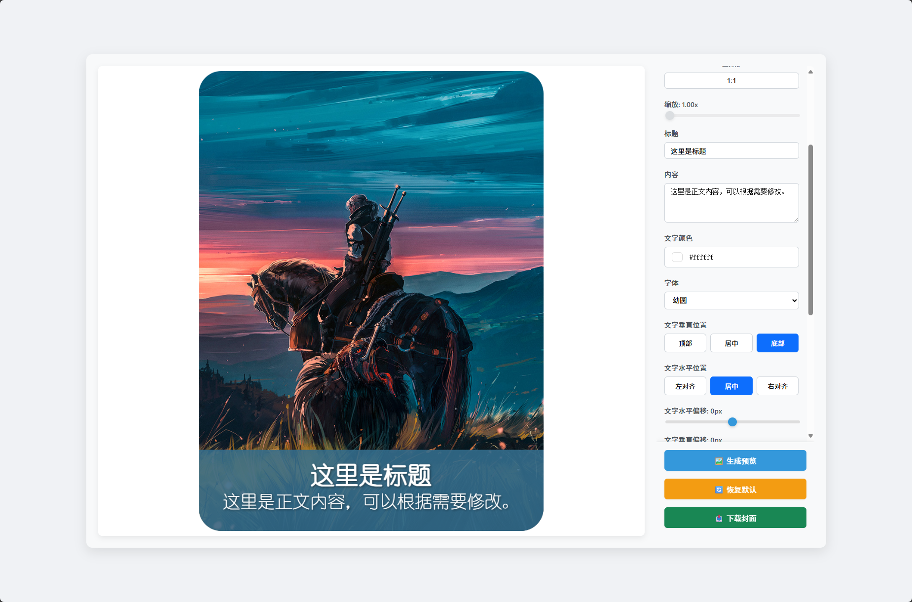

# CoverMaker - 封面制作工具

一个基于 React + TypeScript 的在线封面制作工具，支持图片上传、智能裁剪、文字编辑和一键导出。



## 🚀 功能特性

### 📸 图片处理
- **多种宽高比支持**：16:9、9:16、4:3、3:4、1:1
- **智能裁剪**：基于 react-easy-crop 的交互式裁剪
- **缩放控制**：1x-3x 自由缩放
- **实时预览**：所见即所得的编辑体验

### ✍️ 文字编辑
- **双层文字**：标题和正文内容独立控制
- **字体大小**：标题(12-300px)、正文(8-200px)
- **颜色选择**：支持自定义文字颜色
- **位置控制**：
  - 垂直对齐：顶部、居中、底部
  - 水平对齐：左对齐、居中、右对齐
  - 精确偏移：像素级位置调整
- **间距控制**：标题与正文间距调整
- **拖拽定位**：鼠标直接拖拽调整文字位置

### 🎨 视觉效果
- **文字背景**：半透明背景提高可读性
- **魔法色彩**：自动从图片中提取主色调
- **边框圆角**：可调节的圆角效果
- **实时预览**：即时查看最终效果

### 💾 导出功能
- **高质量导出**：支持高分辨率图片下载
- **一键保存**：点击即可下载成品

## 🛠️ 技术栈

- **前端框架**：React 19 + TypeScript
- **构建工具**：Vite 7.0
- **图片处理**：react-easy-crop + HTML5 Canvas
- **颜色提取**：ColorThief
- **样式**：CSS3 + Flexbox
- **容器化**：Docker + Docker Compose

## 📦 快速开始

### 本地开发

1. **克隆项目**
```bash
git clone <repository-url>
cd CoverMaker
```

2. **安装依赖**
```bash
npm install
```

3. **启动开发服务器**
```bash
npm run dev
```

4. **打开浏览器**
访问 `http://localhost:5173` 开始使用

### 使用 Docker

项目提供了完整的 Docker 支持，详细说明请查看 [Docker使用说明](Docker_使用说明.md)

1. **开发环境**
```bash
docker-compose up dev
```

2. **生产环境**
```bash
docker-compose up prod
```

## 🎯 使用指南

### 1. 上传图片
- 点击"上传图片"按钮选择本地图片
- 支持常见图片格式（JPG、PNG、GIF等）

### 2. 裁剪图片
- 选择合适的宽高比（竖屏、横屏、正方形）
- 拖拽调整裁剪区域
- 使用滑块调整缩放比例
- 点击"应用裁剪"确认

### 3. 编辑文字
- 修改标题和正文内容
- 调整字体大小和颜色
- 设置文字对齐方式
- 使用滑块精确调整偏移量
- 或直接拖拽文字到想要的位置

### 4. 样式调整
- 开启/关闭文字背景
- 调整背景色和透明度
- 使用魔法色自动匹配图片主色调
- 设置边框圆角

### 5. 导出保存
- 点击"生成预览"查看最终效果
- 点击"下载图片"保存到本地

## 📁 项目结构

```
CoverMaker/
├── src/
│   ├── components/          # 核心组件
│   │   ├── CoverMaker.tsx  # 主容器组件
│   │   ├── Canvas.tsx      # 画布和预览组件
│   │   ├── Controls.tsx    # 控制面板组件
│   │   └── ImageUploader.tsx # 图片上传组件
│   ├── context/            # 状态管理
│   │   └── CoverContext.tsx # 全局状态上下文
│   ├── utils/              # 工具函数
│   │   ├── cropImage.ts    # 图片裁剪和合成
│   │   └── colorExtractor.ts # 颜色提取
│   ├── App.tsx            # 应用入口
│   └── main.tsx           # 渲染入口
├── public/                # 静态资源
├── docker-compose.yml     # Docker编排文件
├── Dockerfile            # 生产环境镜像
├── Dockerfile.dev        # 开发环境镜像
└── package.json          # 项目配置
```

## 🔧 开发脚本

```bash
# 开发环境
npm run dev

# 构建生产版本
npm run build

# 代码检查
npm run lint

# 预览构建结果
npm run preview
```

## 🚀 部署

### 构建生产版本
```bash
npm run build
```

### 使用 Docker 部署
```bash
# 构建镜像
docker build -t covermaker .

# 运行容器
docker run -p 80:80 covermaker
```

## 🤝 贡献指南

1. Fork 项目
2. 创建特性分支 (`git checkout -b feature/AmazingFeature`)
3. 提交更改 (`git commit -m 'Add some AmazingFeature'`)
4. 推送到分支 (`git push origin feature/AmazingFeature`)
5. 创建 Pull Request

## 📄 许可证

该项目采用 MIT 许可证 - 查看 [LICENSE](LICENSE) 文件了解详情

## 🙏 致谢

- [React](https://reactjs.org/) - 前端框架
- [Vite](https://vitejs.dev/) - 构建工具
- [react-easy-crop](https://github.com/ricardo-ch/react-easy-crop) - 图片裁剪
- [ColorThief](https://github.com/lokesh/color-thief) - 颜色提取

## 📞 联系方式

如果您有任何问题或建议，请通过以下方式联系：

- 创建 [Issue](../../issues)
- 提交 [Pull Request](../../pulls)

---

⭐ 如果这个项目对您有帮助，请给我们一个 Star！
